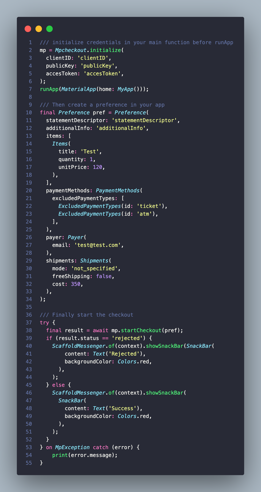

# mpcheckout

An unofficial package of MercadoPago Mobile Checkout.

## Requirements

- Android minSdk 19
- iOS 10.0

### iOS

Currently IOS is no longer supported because MercadoPago changed the px-ios SDK repo to private mode and we can no longer use this SDK.

## How to use

